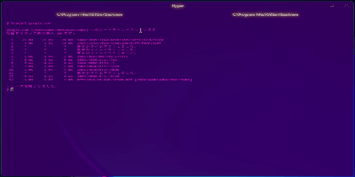
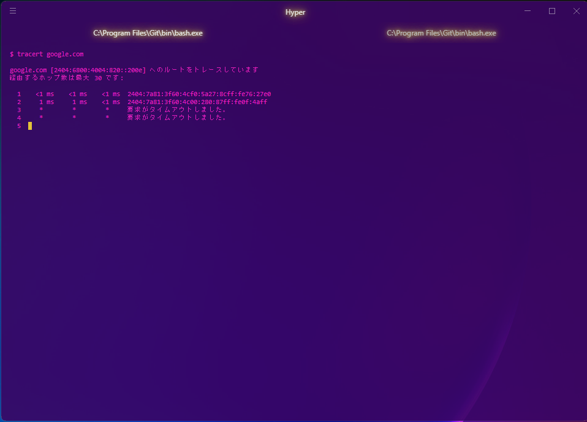

# Hyper-neon-theme
Your [Hyper](https://hyper.is) in neon.
This is a Hyper color theme based on neon colors.



## Installation
1.Open `~/.hyper.js` file then add `'hyper-neon-theme'` to plugins.

```
module.exports = {
  plugins: [
    ...
    'hyper-neon-theme',
    ...
  ],
  ...
};
```
2.Restart Hyper

## Screen Capture

